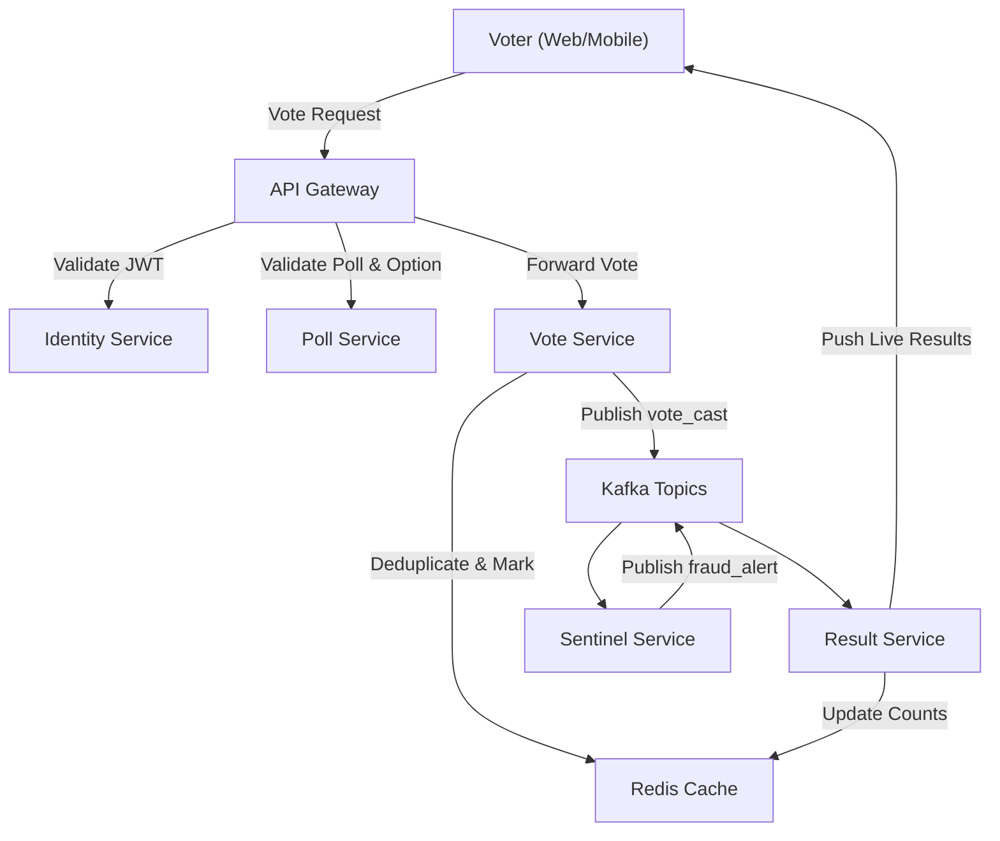
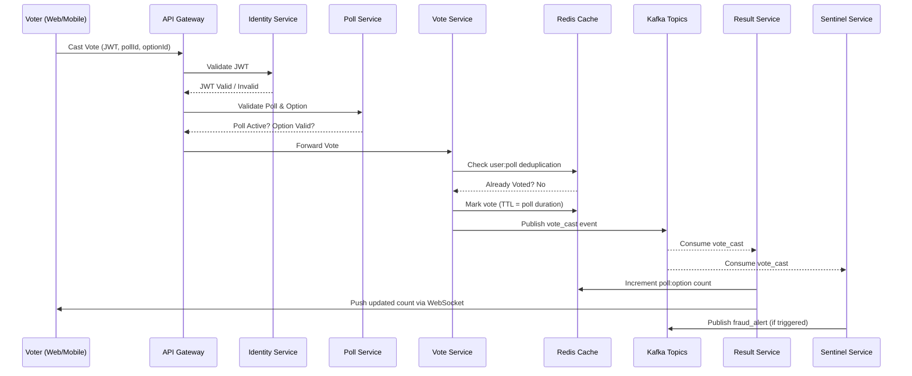

# SwiftPoll - Real-Time Voting & Audience Engagement Platform

[]() 
[]()
[]()
[]()

## 🚀 Live Demo
- **Frontend Application:** [SwiftPoll Live Demo](https://swiftpoll-frontend.vercel.app)
- **API Documentation:** [Swagger UI](https://swiftpoll-api-gateway.render.com/swagger-ui)
- **System Architecture Video:** [Watch Full Demo](https://your-video-link.com)

## 📋 Project Overview

SwiftPoll is a **multi-tenant, B2B SaaS platform** designed to handle massive real-time voting events with enterprise-grade reliability. Built for media companies and live event organizers who need to process **>50,000 votes per second** without system failure.

### Key Problem Solved
Existing polling solutions crash during traffic spikes, lose critical voting data, and are vulnerable to fraud. SwiftPoll provides a fraud-resistant, hyper-scalable backend that maintains **>99.95% uptime** during peak events.

### Performance Targets
- **Peak Ingestion:** 50,000+ votes/second
- **Event Volume:** 10M+ votes per hour
- **Uptime:** 99.95% during live events
- **Fraud Detection:** Real-time pattern analysis

## 🏗️ System Flow Digram


## 🏗️ Sequence Digram 




## 📦 Microservices Repository Structure

### Infrastructure Services
| Service | Repository | Description | Tech Stack |
|---------|------------|-------------|------------|
| **Config Server** | [🔗 swiftpoll-config-server](https://github.com/mohd-arif-shaikh/config-server) | Centralized configuration management | Spring Cloud Config |

### Core Application Services
| Service | Repository | Description | Tech Stack |
|---------|------------|-------------|------------|
| **API Gateway** | [🔗 api-gateway](https://github.com/mohd-arif-shaikh/api-gateway) | Single entry point, JWT validation, routing | Spring Cloud Gateway |
| **Identity Service** | [🔗 identity-service](https://github.com/mohd-arif-shaikh/identity-service) | Multi-tenant auth, user management, JWT minting | Spring Security, PostgreSQL |
| **Poll Service** | [🔗 poll-service](https://github.com/mohd-arif-shaikh/poll-service) | Poll lifecycle management, CRUD operations | Spring Boot, PostgreSQL |
| **Vote Ingestion** | [🔗 vote-service](https://github.com/mohd-arif-shaikh/vote-service) | High-throughput vote processing, deduplication | Spring Boot, Redis, Kafka |
| **Results Service** | [🔗 result-service](https://github.com/mohd-arif-shaikh/result-service) | Real-time aggregation, WebSocket updates | Spring Boot, Redis, WebSocket |
| **Anti-Fraud Service** | [🔗 sentinel-service](https://github.com/mohd-arif-shaikh/sentinel-service) | ML-based fraud detection, pattern analysis | Spring Boot, Kafka, Redis |

### Configuration & Frontend
| Repository | Description |
|------------|-------------|
| [🔗 swiftpoll-config](https://github.com/mohd-arif-shaikh/swiftpoll-config) | Externalized YAML configurations (Private) |
| [🔗 swiftpoll-frontend](https://github.com/mohd-arif-shaikh/swiftpoll-frontend) | React TypeScript frontend application |

## 🛡️ Advanced Fraud Detection System

SwiftPoll implements a **"Flag, Don't Block"** philosophy with layered fraud detection:

### Layer 1: The Moat (New Account Spam)
- Detects accounts created within 60 seconds of voting
- Risk Signal: `NEW_ACCOUNT_SPAM`

### Layer 2: The High Wall (IP Velocity)
- Sliding window counters track votes per IP
- Threshold: >10 votes/minute triggers `VELOCITY_ATTACK`

### Layer 3: The Watchtowers (Geographic Jump)
- Detects impossible geographic movements
- Example: USA → India in 5 seconds = `GEOGRAPHIC_JUMP`

## 🛠️ Technology Stack

- **Backend:** Java 17, Spring Boot 3, Spring Cloud
- **Messaging:** Apache Kafka (Confluent Cloud)
- **Databases:** PostgreSQL (Primary), Redis (Caching/Counters)
- **Authentication:** Spring Security with JWT
- **Stream Processing:** Apache Flink (Local), Spring Boot (Production)
- **Frontend:** React, TypeScript, WebSocket
- **Infrastructure:** Docker, Docker Compose
- **Deployment:** Render.com (Backend), Vercel (Frontend), Upstash (Redis)

## 🚦 Quick Start

### Prerequisites
- Docker & Docker Compose
- Java 17
- Node.js 18+

### Local Development
```bash
# Clone the platform monorepo
git clone https://github.com/mohd-arif-shaikh/swiftpoll-platform
cd swiftpoll-platform

# Start all 8 microservices
docker-compose up -d

# Clone and start frontend
git clone https://github.com/mohd-arif-shaikh/swiftpoll-frontend
cd swiftpoll-frontend
npm install && npm start
```

Access the application at `http://localhost:3000`

## 📊 Key Features

### For Platform Administrators
- **Multi-tenant Management:** Isolated customer environments
- **Real-time Monitoring:** System health and fraud alerts
- **Scalability Controls:** Auto-scaling based on load

### For Tenant Administrators
- **Poll Creation:** Rich poll management with real-time analytics
- **Fraud Insights:** Detailed fraud detection reports
- **Custom Branding:** White-label voting experiences

### For Voters
- **Frictionless Voting:** Single-click voting experience
- **Real-time Results:** Live updating vote counts
- **Cross-platform:** Mobile and desktop optimized

## 📈 Performance & Scalability

- **Horizontal Scaling:** Stateless services with Redis-backed state
- **Event-Driven Architecture:** Kafka ensures resilience during traffic spikes
- **Optimized Ingestion:** Sub-100ms vote processing latency
- **Circuit Breakers:** Fault tolerance with graceful degradation

## 🎯 Business Impact

SwiftPoll solves critical pain points for live event organizers:
- **No More Crashes:** Handles 10M+ votes without system failure
- **Fraud Prevention:** Real-time detection saves event integrity
- **Instant Insights:** Live analytics drive audience engagement
- **Enterprise Scale:** Multi-tenant SaaS reduces operational overhead

## 📋 Development Methodology

- **Domain-Driven Design:** Each service owns its business domain
- **Event Sourcing:** Kafka provides audit trail and replay capability
- **Defense in Depth:** Security at every layer of the stack
- **Cloud-Native:** 12-factor app principles with externalized config

## 🔧 Local Development Architecture

The full-scale architecture with Apache Flink is demonstrated locally. The production deployment uses a simplified results-service for cost optimization while maintaining the same API contracts.

## 📝 Documentation

- [API Documentation](./docs/api.md)
- [Architecture Deep Dive](./docs/architecture.md)
- [Fraud Detection Rules](./docs/fraud-detection.md)
- [Deployment Guide](./docs/deployment.md)
- [Contributing Guide](./CONTRIBUTING.md)

## 👨‍💻 About This Project

SwiftPoll demonstrates enterprise-level software architecture, focusing on:
- **Microservices Design Patterns**
- **Event-Driven Architecture**
- **Real-time Systems at Scale**
- **Multi-layered Security**
- **Cloud-Native Development**

Perfect for showcasing distributed systems expertise and real-world problem-solving in high-traffic scenarios.

---

**Built with ❤️ by [Your Name]** | **Contact:** [your.email@domain.com] | **LinkedIn:** [Your Profile]
